# Мечта о масштабируемых и обогащенных подписках на GraphQL

[В своей прошлой статье](https://habr.com/ru/articles/518554/) я писал о нашем пятилетнем путешествии с GraphQL в [Pipedrive](https://www.pipedrive.com/ru). Теперь я хочу рассказать вам о десятилетнем пути доставки событий через websocket на фронтенд. Надеюсь, это будет полезно и вам.

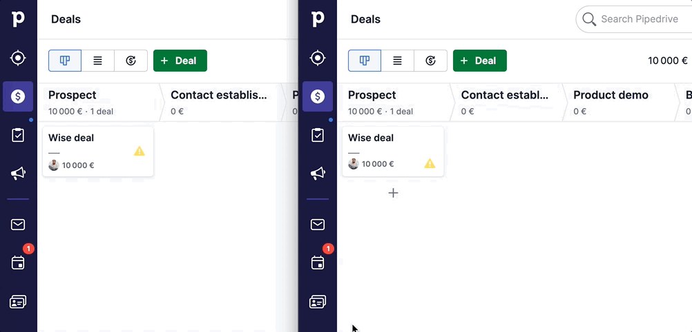

## "Зачем?"

Необходимость в асинхронных событиях возникает каждый раз, когда серверу нужно о чем-то уведомить пользователя. Это может быть связано с тем, что

- Вы получили мгновенное сообщение
- Загруженное изображение завершило изменение размера
- Ваш коллега сменил аватар
- Массовое изменение 10 000 сделок завершено на 99 %.

Таким образом, события async **обогащают UX деталями и интерактивностью.** Но самое главное - они решают проблему **непоследовательности данных**, отображаемых или хранимых на стороне браузера.

Без этих обновлений пользователи не увидят *переименования сделок в Pipedrive*, а на другой вкладке браузера не получат *удаленные действия*. Даже в одной и той же вкладке браузера ваши представления могут плохо работать друг с другом, не иметь единого хранилища и быть рассинхронизированными. Обычно веб-сайты решают эту проблему с помощью [`pusher`](https://pusher.com/), [`liveblocks`](https://liveblocks.io/), [`firebase`](https://firebase.google.com/) или собственного сервиса websocket.

## Немного истории

К счастью, Pipedrive "решил" эту проблему еще десять лет назад. В 2012 году [Андрис](https://www.linkedin.com/in/andris-reinman/), [Капп](https://www.linkedin.com/in/martinkapp/) и [Таджур](https://www.linkedin.com/in/martintajur/) разработали собственный сервис **socketqueue**, который и по сей день переносит события API 100 000+ компаний на фронтенд, используя библиотеку [sockjs](https://www.npmjs.com/package/sockjs).

Доклад Таджура в 2016 году стал одной из причин, по которой я воссоздал подобную систему. Я был озадачен тем, как управлять соединениями пользователей с помощью [`socket.io`](https://socket.io/) и масштабировать его за пределы одного сервера - и в итоге присоединился к Pipedrive, чтобы выяснить это. Потоковая передача событий и возможности, которые она открывает, очаровали меня.

https://www.youtube.com/watch?v=y2Dpj4QElv4

Как вы видите, доклад Таджура был больше посвящен [`RabbitMQ`](https://www.rabbitmq.com/) - брокеру сообщений между PHP-монолитом и socketqueue.

## Плюсы и минусы

Очереди in-memory позволили Pipedrive выдерживать всплески событий, вызванных внешними интеграциями или внутренними действиями, такими как импорт сделок из файла .xls или массовое редактирование.

Событие API, передаваемое в RabbitMQ и на фронтенд, **денормализуется**, имея разные сущности. Это хорошо, потому что у вас есть **последовательный снимок** нескольких вещей в одно и то же время, и вашим получателям **не нужно ничего запрашивать заново**.

Однако это также крайне **неэффективно**, поскольку все вкладки браузера получают все возможные изменения, независимо от того, нужны они пользователю или нет. У одного из клиентов объем интернет-трафика достигал 80 ГБ в день. Кроме того, не забывайте, что веб-приложение на стороне клиента должно выполнять всю тяжелую фильтрацию при получении изменений. Поэтому мы не можем бесконечно раздувать схему событий, делая ее еще более тяжелой.

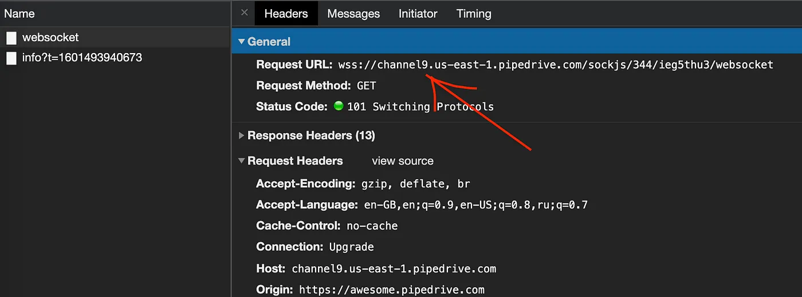

Вторая проблема - **шумные соседи**. Как я уже говорил, масштабируемость решается с помощью "логики ячеек" (в хорошем сценарии - она же изоляция арендаторов), что означает разделение серверов приложений socketqueue по идентификаторам компаний. Это также означает, что мы должны иметь **фиксированное количество контейнеров** и очередей, чтобы обеспечить предсказуемую маршрутизацию.

Таким образом, возникает проблема, когда одна компания генерирует тысячи событий, которые не распределяются по всем серверам. Вместо этого они **нагружают процессор** одного узла до отказа. Нет никакой возможности вертикально нарастить одноядерный процессор, только удвоить количество серверов, что означает **напрасную трату ресурсов инфраструктуры**.

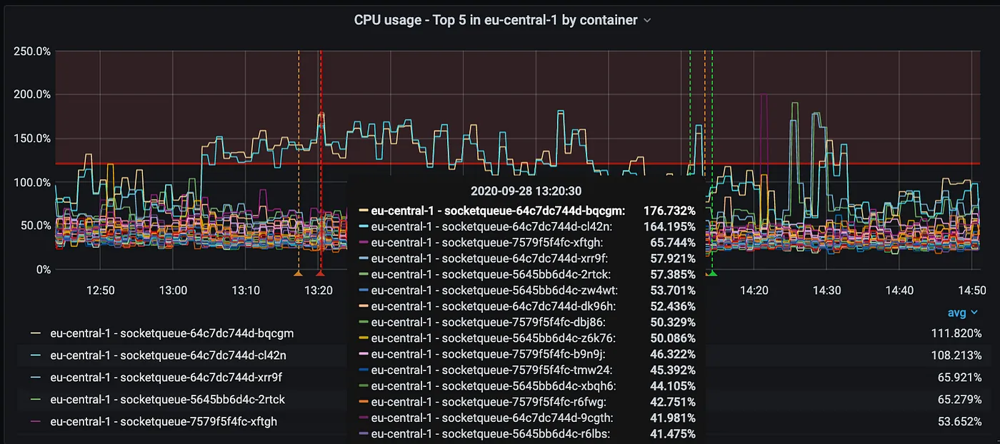

Третья проблема - **видимость и отслеживание.** Как и в случае с REST API, без надлежащей документации (будь то swagger или определения типов) очень сложно понять, что может находиться внутри события и кто что использует, если вы захотите внести изменения. Это приводит к порочному кругу, когда никто ничего не удаляет из события и раздувает его еще больше.

Наконец, если веб-сокетное соединение прервалось из-за того, что пользователь ушел в туннель или закрыл ноутбук, он может потерять события. Может ли это привести к несоответствию важных данных для пользователя?

На протяжении многих лет мы старались оптимизировать socketqueue таким образом, чтобы он соответствовала требованиям:

- Многопоточность, поскольку она прослушивает очереди и обрабатывает соединения WS
- Сжатие трафика
- Проверка разрешения и видимость.

Но что, если бы мы могли сделать еще лучше? 🤔

## "Как?"

Идея [подписок на GraphQL](https://spec.graphql.org/June2018/#sec-Subscription-Operation-Definitions) довольно проста - вы объявляете только то, что хотите получать, после указания некоторых аргументов фильтрации. А задача сервера - грамотно фильтровать события.

Я не смогу объяснить базовую настройку лучше, чем это делает [Бен](https://twitter.com/benawad). Он демонстрирует один экземпляр сервера, где pubsub - это просто маршрутизация событий в памяти, запускаемая мутацией. Но в нашем случае никаких мутаций нет - реальные изменения генерируются наследием PHP далеко-далеко.

https://www.youtube.com/watch?v=_r2ooFgBdoc

## Масштаб миссии

Итак, что я хотел достичь:

- Продемонстрировать подписки на GraphQL в продакшене, имея явную схему
- Протестировать горизонтальное масштабирование pod-ов
- Повысить надежность за счет использования kafka вместо rabbitMQ
- Небольшие, нормализованные события домена, чтобы все было просто
- Задержка доставки событий менее двух секунд (чтобы это было не медленнее, чем socketqueue, который мы пытаемся заменить).

### Риски

Чего я не знал:

- Как мы аутентифицируемся.
- Какой протокол использовать. SSE? WS? Что это за штука - [`mercure`](https://github.com/dunglas/mercure), и не сводится ли она к pooling?
- Будут ли WS/TCP-соединения привязаны к одному pod-у.
- Можем ли мы делать несколько подписок одновременно.

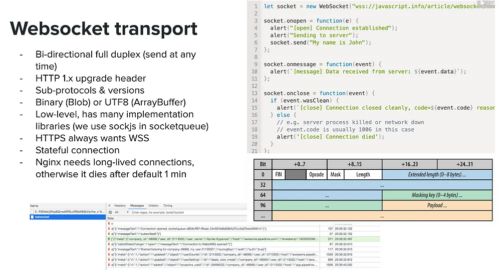
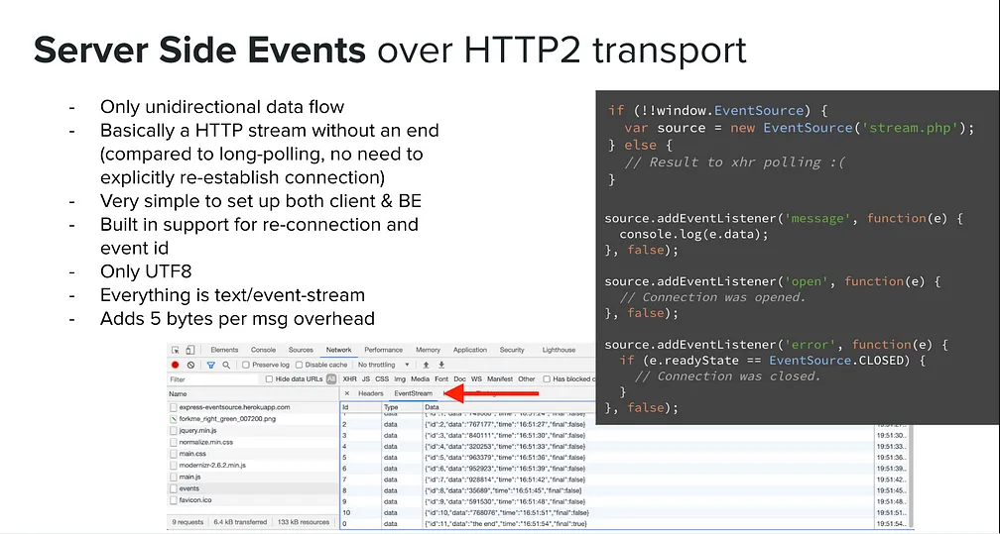

- Какую среду хранения или передачи данных использовать? БД? Потоки Redis? Кафка? Redis pubsub? KTable?
- Можем ли мы перематывать события во времени, если пользователь отключился от сети?
- Нужно ли хранить ID курсора для каждой сущности. Также, как работает живой запрос?
- Как фильтровать события по компании, пользователю, сессии и сущности. Существует ли стандарт для полей фильтра подписки?
- Можем ли мы повторно использовать федеративную схему GraphQL? Можем ли мы обогащать события? Какой должна быть логика QoS (Quality of Service) или повторных попыток, если шлюз не работает? (Ли Байрон подробно разбирал этот вопрос [в своем докладе](https://youtu.be/rapO30fpREg?t=6675) более пяти лет назад).
- На какое количество элементов мы можем подписаться?
- Как отменить подписку или отключить пользователей, когда они выходят из системы?

## Доказательство концепции

Перед тем как приступить к выполнению [задания](https://medium.com/pipedrive-engineering/scaling-pipedrive-engineering-from-teams-to-tribes-8f14fd92df8c), я сделал простой узловой сервис, который подключался к kafka и проксировал события без какой-либо фильтрации. Это уже было многообещающе. Но я хотел попробовать [`go`](https://go.dev/), который позволяет задействовать все доступные процессоры, максимально повышая эффективность. PoC был запасным вариантом, который на деле оказался очень полезным.

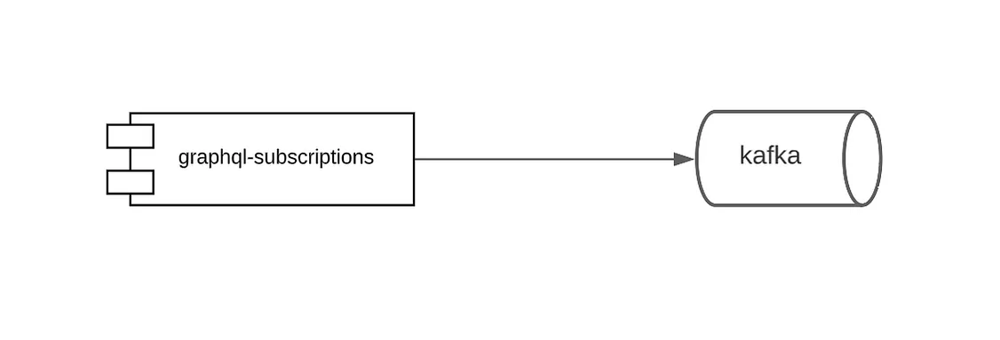
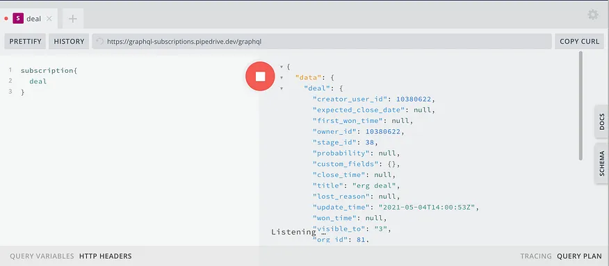

## Взлет

Четверо из нас ([я](https://www.linkedin.com/in/kurapov/), [Павел](https://www.linkedin.com/in/pavel-nikolajev-84184a64/), [Кристьян](https://www.linkedin.com/in/kristjan-luik-89bb03122/) и [Хиро](https://www.linkedin.com/in/abhishek-goswami-591541b1/)) решили попробовать исследовать неизведанное 🛸 - и вернуть ценность на стартовую площадку.

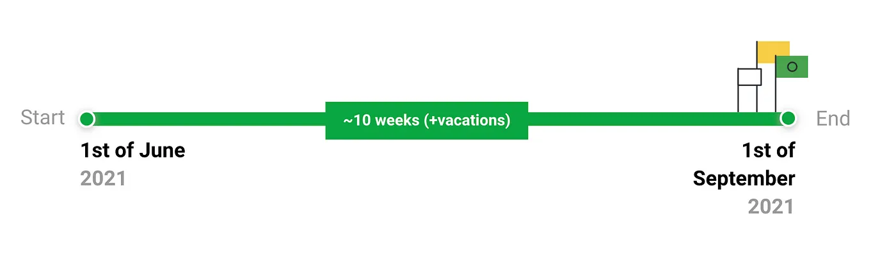

## GraphQL-Go

Сначала мы изучили [`graph-gophers/graphql-go`](https://github.com/graph-gophers/graphql-go) и за пару дней создали PoC (Proof of Concept) для подписки на события kafka

https://www.youtube.com/watch?v=LI1YTFMi8W4

Вот что произошло:

- Мы столкнулись с дилеммой, когда спецификация целых чисел GraphQL [не совпадает со спецификацией int32 в go](https://github.com/graphql/graphql-js/issues/292#issuecomment-186702912).
- Мы осуществили фильтрацию по свойствам и фильтрацию по аргументам.
- Мы столкнулись с необходимостью использования SSL для работы WSS. В противном случае CORS блокировал запросы
- Мы заставили [nginx проксировать запросы через веб-сокет](http://nginx.org/en/docs/http/websocket.html)!
- Мы обнаружили, что существует два транспортных протокола. WebSocket - это свободный транспорт, поэтому любая библиотека может реализовать все, что захочет. В `graphql-go` была реализована старая версия - [`graphql-transport-ws`](https://github.com/graph-gophers/graphql-transport-ws), которая была совместима с Apollo и GraphQL, но не с `graphql-ws`.
- Мы столкнулись с проблемой, что Apollo federation lib не понравилась `Subscription` [в регистрации схем](https://github.com/pipedrive/graphql-schema-registry).

Базовая фильтрация была довольно простой. Нам нужно было соединить два потока (канала) - kafka и веб-сокеты (которые `graphql-go` применяет в качестве резольверов схем) - и при этом иметь в середине горутину, преобразующую данные.

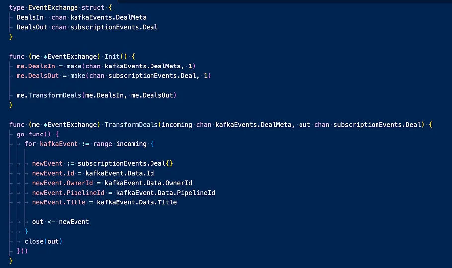
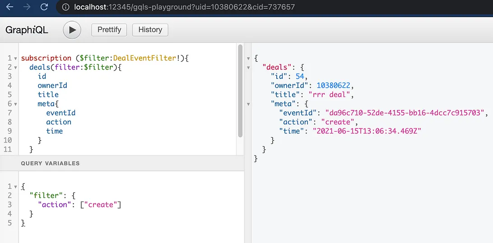

Мы столкнулись с серьезной проблемой, [связанной с GraphQL-Go](https://github.com/graph-gophers/graphql-transport-ws/pull/9) и JWT-аутентификацией. Мы не имели большого опыта работы с go, и у нас не было много времени на изменение крупного фреймворка.

Мы также решили, что обогащение не является приоритетом, и что нам нужно вывести код в продакшн (🚀) и протестировать масштабирование. Таков путь agile.

Вторым большим препятствием стала проверка видимости сущностей. Чтение событий домена из kafka означало, что у нас не было никакой дополнительной информации, например, кто может видеть сделку. Нам нужно было запросить микросервис об этом. Выполнение такого запроса для каждого события каждой компании может легко привести к DoS (Denial of Service). 🤦‍♂️

### GqlGen

Мы оставили `graphql-go` и перешли на [`gqlgen`](https://github.com/99designs/gqlgen). Логика обмена каналами осталась прежней, а [аутентификация по токену JWT](https://github.com/golang-jwt/jwt) заработала. Разница заключалась в том, что события подписки теперь генерировались в коде автоматически на основе `schema.graphql`.

Далее я обнаружил, что обмен (in-memory pub-sub в go) был несколько несовершенен. Нам нужна была хотя бы одна подписка, чтобы происходило потоковое вещание (новая версия немного лучше и позволяет использовать один канал на компанию).

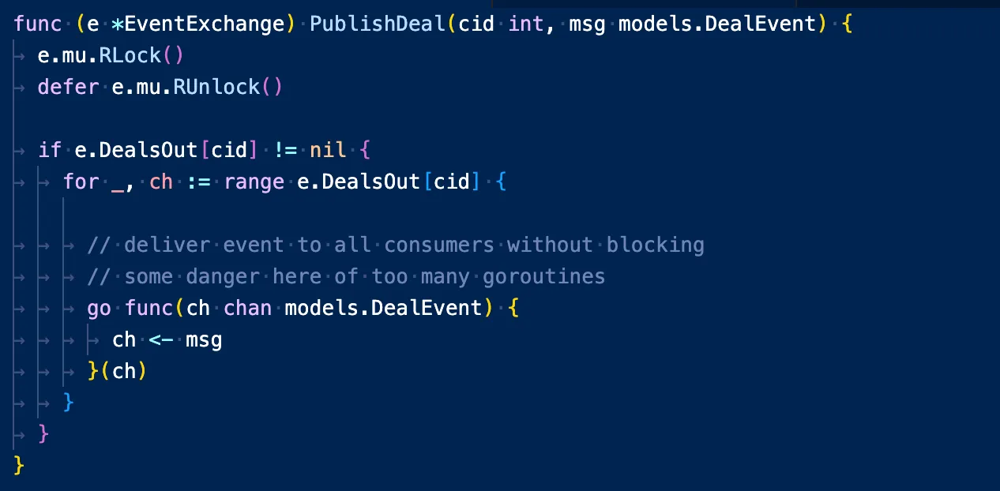
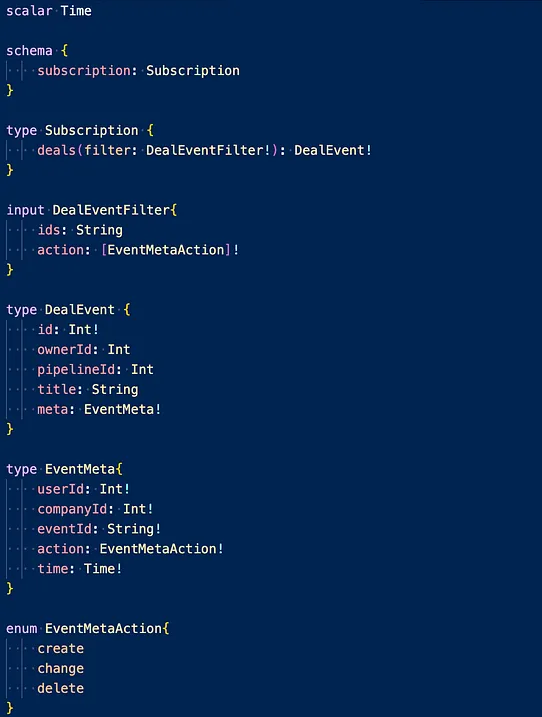

Мы также начали мозговой штурм, чтобы схема выглядела масштабируемой для различных сущностей - чтобы иметь фильтры, действия с несколькими сущностями и поддерживать несколько идентификаторов.

Через месяц у нас был рабочий пользовательский интерфейс со взломанной, но функциональной проверкой прав доступа. Мы сделали перерыв, чтобы дать всему немного остыть. 🌴

(Только тогда я увидел эту 🤯 презентацию [Мэнди Уайз](https://twitter.com/mandiwise) из Apollo, хотя к тому моменту я уже просмотрел большинство доступных видео на YouTube).

https://www.youtube.com/watch?v=C5pSwLpjZM0

### Окончательная архитектура

Итак, мы вернулись и снова попробовали `gqlgen`. Это было болезненно, но, что ж... проворно. Мы разделили сервис **на две части**, добавив между ними redis pub-sub с репликацией и sentinel.

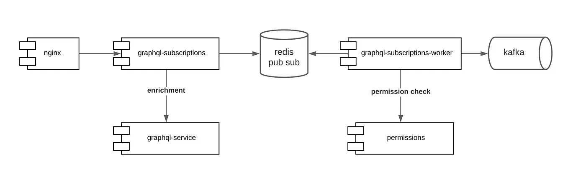

- `graphql-subscription-workers` остался в `go`, но стал намного проще - он смог хорошо масштабироваться и потреблять все разделы kafka. Воркеры отфильтровывали события, выполняя десять параллельных проверок прав доступа и преобразуя схему событий при необходимости.
- `graphql-subscriptions` работал с соединениями и масштабировался горизонтально настолько, насколько это было необходимо. Она использовала замечательную библиотеку [`graphql-ws`](https://github.com/enisdenjo/graphql-ws), которая имеет всевозможные хуки, так что спасибо [Денису Бадурину](https://github.com/enisdenjo).
- Redis pub-sub служил брокером обмена, выполняя большую часть фильтрации и шардинга по идентификаторам компаний, пользователей и организаций.

### Маршрутизация Redis

Redis pub-sub действует как маршрутизатор, очень похожий на RabbitMQ. Он потребляет очень мало памяти и обеспечивает сопоставление подстановочных символов regex.

Например, `graphql-subscriptions-worker` отправляет события в канал Redis с ключом `"<companyId>.deal.<dealId>"`. Это позволяет `graphql-subscriptions` выборочно подписываться на определенные каналы, основываясь на том, какой идентификатор сделки был указан в подписке.

### Типы схем подписок

Итак, как видно из диаграммы, мы последовали совету Мэнди и написали обогащение событий с помощью запросов к шлюзу. Это потребовало опроса федеративной схемы и жесткого кодирования резолверов для каждой сущности.

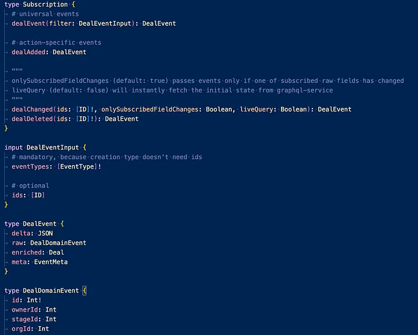

Нам пришлось сделать выбор схемы:

- Мы не стали объединять исходные события с обогащенными, хотя могли бы. Это было связано с тем, что у нас не было никакой гарантии, что graphql-сервис ответит своевременно. "Сырые" данные о событиях из Kafka были гораздо надежнее. Также были небольшие различия в схеме при использовании ссылок (raw deal.stageId против enriched deal.stage.id).
- Мы добавили "дельту" в виде JSON, в основном потому, что фронтенд действительно хотел использовать ее в случае, если фронтенд-хранилище хочет обновлять только определенные ключи. Однако для этого требовалась особая форма события kafka.
- У нас был общий тип события (`dealEvent`), а также события, специфичные для конкретного действия (`dealAdded`). Общие события учитывают правильный порядок событий для одной и той же сущности (добавлена > изменена > удалена), который не гарантируется в хронологическом порядке, если вы подписываетесь на отдельные типы.

### Живые запросы

Это классная концепция, которая элегантно решает проблему, на которой я действительно зациклился, - потерю соединения.

[Из статьи Лорина](https://the-guild.dev/blog/subscriptions-and-live-queries-real-time-with-graphql) в The Guild у нас была одна и та же функция **fetchOrSubscribe**, которая сначала выполняла запрос на обогащение, а затем подписывалась на события kafka, используя магию асинхронных итераторов. Разница, однако, заключалась в схеме - мы использовали "liveQuery" в качестве аргумента, а не в качестве корневого свойства.

Уже одно это удовлетворяло 99% требований к согласованности для веб-приложений, без необходимости перематывать события (возможно, с помощью [потоков redis](https://redis.io/docs/data-types/streams/)). Таким образом, "ревалидация и диффузия запросов на основе курсора", [предложенная Беном Ньюманом на последнем GraphQL Summit](https://twitter.com/benjamn/status/1579891243798401026), кажется очень редким случаем использования, когда вам нужна перемотка событий в качестве нишевой функции продукта (возможно, для игр).

## Тестирование производительности и безопасности

Наконец, к концу миссии мы проверили, насколько хорошо наше решение масштабируется в производстве, постепенно внедряя его у реальных клиентов.

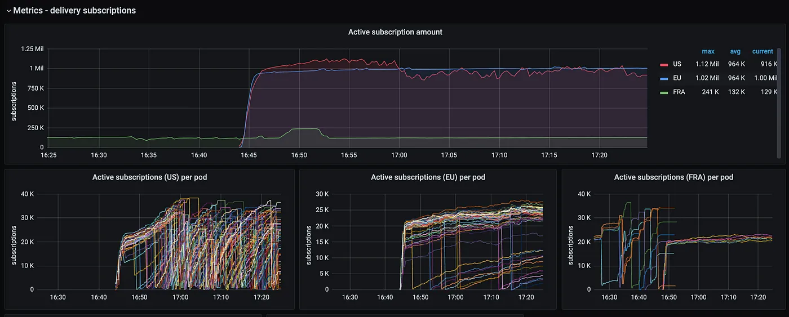

Это позволило выявить несколько интересных моментов. Например, если подписываться на *сделки* по идентификаторам и делать это *в представлении pipeline*, где пользователи могут прокручивать страницу очень быстро, можно получить волны подписок. Поэтому лучше избегать блокировки проверок разрешений в функции подписки и вместо этого использовать логику дросселирования на фронтенде.

Мы также наблюдали, как случайные pod-ы внезапно теряли все свои соединения. Это заставило нас пересмотреть лимиты памяти и ошибку [max_old_space_size](https://github.com/nodejs/node/issues/35573).

Мы внедрили различные ограничения безопасности на количество подключений, подписок и таймаутов, принимая во внимание выходы из системы, изменения прав и т. д. Это связано не только с внешними рисками, но и с тем, что Redis требует много вычислительной мощности (CPU) для сопоставления издателей и подписчиков.

## Будущие шаги

Теоретически, мы можем разделить экземпляры Redis по типам сущностей, если у нас возникнут проблемы с производительностью.

Мы могли бы принудительно отказаться от использования socketqueue, *временно* добавив события API в качестве универсальной подписки, проксирующей все данные на фронтенд без какой-либо фильтрации. Это принесет в жертву эффективность ради единого транспортного уровня.

Этот сервис работает уже больше года, и на данный момент мы поддерживаем около десяти сущностей, привязанных к различным темам kafka.

### В защиту GraphQL

В Pipedrive считают, что внедрение GraphQL и подписок в частности происходит медленно и сложно. Вот почему:

1. Мы используем GraphQL только в новых микрофронтендах. Замена представлений, зависящих от backbone.js, рискованна и требует рефакторинга.
2. Это добровольно. У нас нет специальной команды, которая владеет supergraph и заставляет каждый сервис предоставлять схему GraphQL.

С обратной стороны, [codegen](https://www.youtube.com/watch?v=UZWe5Usun7I&t=4130s), призванный облегчить внедрение и обернуть REST API, может показаться сложным. Принятие GraphQL в микросервисе наряду с REST API может показаться **излишним**.

[Шлюз федерации Apollo](https://www.apollographql.com/docs/federation/) можно рассматривать как еще один уровень сложности, несмотря на то, что он планирует и выполняет множество запросов.

Окупаемость инвестиций не видна, если *ценность* не измеряется.

GraphQL взял на себя огромную ответственность за то, чтобы сделать веб более прозрачным, предсказуемым, многократно используемым и эффективным. Я призываю разработчиков запастись профессиональным терпением - обучайте своих коллег, сравнивайте его с RPC ([gRPC](https://grpc.io/), [tRPC](https://trpc.io/), [xmlRPC](http://xmlrpc.com/), [JSON-RPC](https://www.jsonrpc.org/specification)) и REST ([json:api](https://jsonapi.org/), [odata](https://www.odata.org/)), измеряйте жесткие метрики и доказывайте превосходство GraphQL.

Я мечтаю, что наступит день, когда разработчики заменят бессхемные REST API и WS-события на GraphQL и подписки для всех. Клиенты - это будущее. Это путь.

